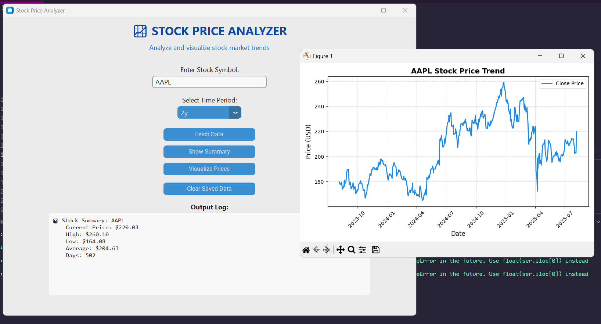

# Stock Price Analyzer

> Analyze stock prices with a clean Python GUI.

A Python GUI application to fetch, analyze, and visualize stock prices using **CustomTkinter**, **Pandas**, **Matplotlib**, and **yfinance**.

## Features
- Search and fetch data for any stock symbol  
- View detailed summary statistics  
- Interactive trend and price charts  
- Export stock data to CSV

## Installation
```bash
git clone https://github.com/atharvtkn/stock-analyzer.git
cd stock-analyzer
pip install -r requirements.txt
```

## Usage
```bash
python maingui.py
```
## App preview screenshot



